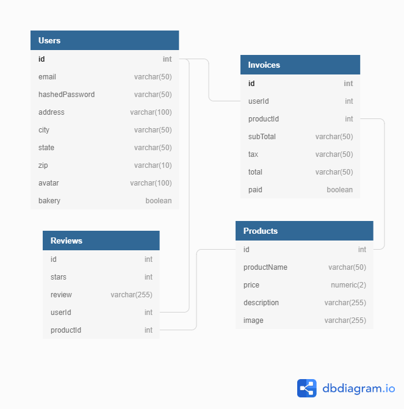

# DAILY BREAD DELIVERY

# MVP's

- splash/welcome
- login/signup
- home/products
- shopping cart/order
- payment/delivery(functionality for accepting payments will be added after scope of class)
- users invoices
- BONUS add widget to track price of wheat/baking commodities

# Frontend

- Uses React/Redux 

# Backend

- Uses express/sequelize

# Database Schema

# API Endpoints

## GET
      "/"
      "/login"
      "/home"
      "/order"
      "/payment"
      "/invoices/user"
      "/invoices/user/:id"
      "/reviews"

## POST
      "/login"
      "/signup"
      "/order"
      "/payment"
      "/reviews"
      

# Technologies Used

- Node-JS 
- Express 
- React 
- Redux 
- Sequelize
- SQL
- PostgreSQL

