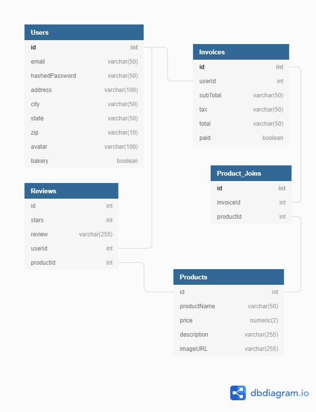

# DAILY BREAD DELIVERY

# MVP's

- login/signup
- home/products
- host product/user photos on S3
- shopping cart/order
- payment/delivery(functionality for accepting payments will be added after scope of class)
- users invoices
- reviews
- BONUS add widget to track price of wheat/baking commodities
- BONUS ability to upload photos

# Frontend

- Uses React/Redux (todo: add screen shots and paragraph)

# Backend

- Uses express/sequelize (todo: add screen shots and paragraph)

# Components

- splash
- login
- signup
- home
- order
- payment
- invoices
- reviews
- bakers

# Database Schema

# API Endpoints

## GET
      "/"
      "/login"
      "/home"
      "/order"
      "/payment"
      "/invoices/user"
      "/invoices/user/:id"
      "/reviews"
      "/bakers"
      "/bakers/:id"

## POST
      "/login"
      "/signup"
      "/order"
      "/payment"
      "/reviews"
      

# Technologies Used

- Node-JS 
- Express 
- React 
- Redux 
- Sequelize
- SQL
- PostgreSQL

